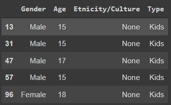
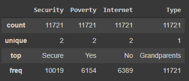

## Planteamiento del Problema

### Objetivo:

*   Desarrollar y productizar un modelo predictivo para predecir el nivel de satisfacción de niños y de abuelos de acuerdo a la composición del hogar y otros determinantes.

### Tipo de Problema:

*   Predicción del nivel de satisfacción de niños y abuelos a partir de la composición del hogar y otros determinantes.

### Información Disponible:

*   El insumo principal de este trabajo son los datos de la Encuesta Nacional de Calidad de Vida - ECV 2020 (17081 registros de abuelos, 18626 registros de niños).

### Método de Machine Learning:

- Realización de dos modelos de regresión lineal múltiple, uno para predecir el nivel de satisfacción de niños y otro el de los abuelos siguiendo el método posterior:
  -   Análisis exploratorio de datos evaluando una gran cantidad de características sin hipótesis pre-especificadas para identificar y seleccionar las características que sirvan como variables predictivas.
  -   Ingeniería de características para construir variables predictivas del modelo.
  -   Modelo de regresión lineal múltiple realizado con las variables predictivas. 

### Evaluación de Métricas, Protocolo de Entrenamiento y Validación:

*   MSE, RMSE y R-Squared serán utilizados para evaluar el rendimiento predictivo de los modelos.
*   13664 registros de abuelos para entrenamiento y 14900 registros de niños para entrenamiento.
*   3417 registros de abuelos para validación y 3726 registros de niños para validación.

## Definiciones

*   Abuelo: para este trabajo se define como abuelo a la persona que es cabeza de hogar y tiene nietos, y su pareja, además de sus padres y suegros en caso de que viva con sus hijos. También es un abuelo la persona que es el padre o madre de la persona cabeza de hogar y esta persona tiene hijos, además que los suegros de esta persona son abuelos.
*   Niño: para este trabajo se define como niño a toda persona que tiene entre 15 y 18 años de edad.

## Flujo de Trabajo

A continuación se presenta el flujo de trabajo realizado:

*Figura 1*. Flujo de Trabajo. Fuente propia.

## Fuentes de Datos y Preprocesamiento

### Poblaciones:

*   Abuelos: sujetos entre 12 y 105 años de edad de Colombia.
*   Niños: sujetos entre 15 y 18 años de edad de Colombia.

### Registro de Muestra y Características de Medición:

*   Encuesta realizada a las familias colombianas por el DANE.

### Recopilación de Datos:

*   Registros de abuelos y niños seleccionados de la base de datos a partir de las definiciones de abuelos y niños presentadas.

### Estructuras de Datos y Tipos:

*   Variables continuas seleccionadas de la base de datos.
*   Variables continuas creadas a partir de la ingeniería de características realizadas.

### Preprocesamiento de Datos:

Para los registros de los abuelos y niños:

* Subconjuntos de datos o agregación:
  * Selección de los sujetos a partir de la definición de abuelo o niño presentada.
* Transformación de datos:
  * Conversión del tipo de datos de objetos a enteros.

### Link a la Información:

*   [Colombia - Encuesta Nacional de Calidad de Vida - ECV 2020](https://www.google.com/url?q=https://microdatos.dane.gov.co/index.php/catalog/718/get_microdata&sa=D&source=editors&ust=1651468799389679&usg=AOvVaw0762i5vpCcXCnA1XNwGwhp) 

## Análisis Descriptivo

### Análisis de datos por individuos

Ahora se analizarán los datos de los abuelos y los niños como individuos.

Se observa una muestra del conjunto de datos de los niños que se analizará y un resumen de las variables cuantitativas de este:

        

        *Figura 2*. Muestra de información de los niños a analizar. Fuente propia.

        

*Figura 3*. Descripción de las variables cuantitativas de los niños a analizar. Fuente propia.

        Se observa que el rango de edad de los niños es de 15 a 18 años.

Luego se presenta una muestra del conjunto de datos de los abuelos que se analizará y un resumen de las variables cuantitativas de este:

*Figura 4*. Muestra de información de los abuelos a analizar. Fuente propia.

*Figura 5*. Descripción de las variables cuantitativas de los abuelos a analizar. Fuente propia.

Se observa que el rango de edad de los abuelos es de 16 a 105 años.

#### Análisis de individuos por el sexo

Seguidamente se representan los datos del sexo por medio de un gráfico de barras comparativo, donde se muestra la cantidad de niños y abuelos con sexo masculino y femenino.

*Figura 6*. Gráfico de barras comparativo de niños y abuelos por sexo. Fuente propia.

Se nota que para los abuelos hay más mujeres que hombres mientras que para los niños las cantidades de niños y niñas son similares.

#### Análisis de datos por la edad

Ahora se representan los datos de edad, los cuales se dividen en edad de niños y edad de abuelos.

Edad de los niños:

        

*Figura 7*. Gráfico de barras de las edades de los niños. Fuente propia.

Se nota que las proporciones de edades de los niños son similares.

Edad de los abuelos:

*Figura 8*. Tabla de las edades de los niños. Fuente propia.

*Figura 9*. Gráfico de dispersión de las edades de los abuelos. Fuente propia.

Cabe aclarar que se utilizó una gráfica diferente al gráfico de barras utilizado para las edades de los niños debido al rango de edad de los abuelos, por lo que se decidió realizar un gráfico de dispersión Edad vs. Cantidad para mostrar la cantidad de personas en cierto rango de edad de los abuelos. Al mirar la gráfica se observa que la mayoría de los abuelos se encuentran entre los 40 y los 80 años de edad.

#### Análisis de datos según la etnia, pueblo o cultura

Después se representan los datos de las etnias/culturas tanto de los niños como de los abuelos en un gráfico de barras comparativo.

*Figura 10*. Gráfico de barras comparativo de las etnias y culturas de los abuelos y niños. Fuente propia.

Se aprecia que la mayoría de abuelos y niños no pertenecen a una etnia o cultura en específico y que en los datos hay muy poca representación de otras etnias y culturas.

### Análisis de datos por hogares

Ahora se analizarán los datos de los hogares donde viven los abuelos y los niños.

Se observa una muestra del conjunto de datos de los niños que se analizará y un resumen de las variables cualitativas de este:

*Figura 11*. Muestra de información de los hogares de los niños a analizar. Fuente propia.

*Figura 12*. Descripción de las variables cualitativas de los hogares de los niños a analizar. Fuente propia.

Se aprecia que la gran parte de los hogares encuestados considera que están seguros, que se encuentran en la pobreza y dicen no tener internet.

*Figura 13*. Muestra de información de los hogares de los abuelos a analizar. Fuente propia.

*Figura 14*. Descripción de las variables cualitativas de los hogares de los abuelos a analizar. Fuente propia.

Se observa que la mayoría de los hogares en los que residen abuelos se encuentran en condiciones similares a los hogares en los que residen los niños.

#### Análisis de datos según sentimiento de seguridad

Ahora se representan los datos de sentimiento de seguridad en los hogares donde residen los niños por medio de un gráfico de barras comparativo.

*Figura 15*. Gráfico de barras comparativo de niños y abuelos por sentimiento de seguridad. Fuente propia.

Al analizar el gráfico se observa que la mayoría de hogares donde residen los abuelos y los niños se sienten seguros.

#### Análisis de datos según sentimiento de pobreza

Luego representamos los datos de sentimiento de pobreza de hogares donde residen niños y abuelos por medio de un gráfico de barras comparativo.

*Figura 16*. Gráfico de barras comparativo de niños y abuelos por sentimiento de pobreza. Fuente propia.

Se aprecia que la proporción de sentimiento de pobreza es similar tanto en los hogares donde residen niños como en los hogares donde residen abuelos, predominando los hogares que sienten que están en la pobreza.

#### Análisis de datos según la tenencia de internet

Ahora se representan los datos sobre los hogares donde residen niños y abuelos que tienen internet.

*Figura 17*. Gráfico de barras comparativo de niños y abuelos por tenencia de internet. Fuente propia.

Se nota que hay más hogares donde residen niños sin internet que hogares donde residen abuelos, y se nota una proporción similar en ambos casos.

## Desarrollo de los Modelos y Validación

### Software Utilizado:

*   Modelos realizados en [Google Collaboratory](https://www.google.com/url?q=https://colab.research.google.com/notebooks/welcome.ipynb?hl%3Des&sa=D&source=editors&ust=1651468799400076&usg=AOvVaw3BsmzIFA0LLERerLBE2zcG) con el lenguaje de programación Python utilizando la librería [Sklearn](https://www.google.com/url?q=https://scikit-learn.org/stable/&sa=D&source=editors&ust=1651468799400362&usg=AOvVaw23RUSQiQ8kNy3KoPx_MyLq).

### Entrenamiento y Validación de los Modelos:

*   Entrenamiento completado utilizando 13664 registros de abuelos y 14900 registros de niños.

### Características Seleccionadas y Entrada a los Modelos:

Las características se seleccionaron teniendo en cuenta la revisión de literatura que se realizó previa al desarrollo de los modelos que permitió llevar a cabo  la ingeniería de características y con base en la evaluación de la correlación de las variables que ya se presentaban en la base de datos.

*   Para el modelo de los abuelos: 'step_in_life', 'free_time_satisfaction', 'health_satisfaction', 'happiness_yesterday', 'life_worthiness', 'job_satisfaction', 'safety_satisfaction', 'worried_level', 'sadness_level', 'home_life_conditions', 'childhouse_home', 'home_incomes', 'kids_amount', 'teenagers_amount', 'sons_amount', 'has_partner'.
*   Para el modelo de los niños: 'step_in_life', 'free_time_satisfaction', 'health_satisfaction', 'happiness_yesterday', 'life_worthiness', 'life_satisfaction', 'safety_satisfaction', 'worried_level' 'sadness_level', 'home_life_conditions', 'childhouse_home', 'has_internet', 'poverty', 'live_after_5_years'.

### Variable a Predecir y Salida de los Modelos:

*   Al realizar el análisis exploratorio en la base de datos se identificó que la variable ‘life_satisfaction’ permite demostrar el nivel de satisfacción de niños y de abuelos de acuerdo a las características seleccionadas, por lo cual, se escogió como variable a predecir tanto para niños como para abuelos.

### Método de Validación:

*   Validación realizada utilizando 3417 registros de abuelos y 3726 registros de niños.

### Reproducibilidad y Reutilización del Código:

* Modelos para niños y abuelos:
  * [código fuente en Google Colab](https://www.google.com/url?q=https://colab.research.google.com/drive/16ONg9wMgshDy7LWFBoMfQunBwa7dj6cN?usp%3Dsharing&sa=D&source=editors&ust=1651468799402566&usg=AOvVaw0tWC-t0il-rrEOolSu0QME)
  * [código fuente en Github](https://www.google.com/url?q=https://github.com/CloaizaF/Trabajo_TAE_1&sa=D&source=editors&ust=1651468799402863&usg=AOvVaw31tac89dtWBVZVogcProDa)

* Modelos para niños y abuelos en producción:
  * [back end](https://www.google.com/url?q=https://github.com/jumarinr/satisfaccion_model&sa=D&source=editors&ust=1651468799403202&usg=AOvVaw3pevcbDMtaaZVaWmw5dmLJ)
  * [front end](https://www.google.com/url?q=https://github.com/jumarinr/prediction-satisfaction&sa=D&source=editors&ust=1651468799403461&usg=AOvVaw3QCVXGL6IQglMXrpFoWwiZ)

## Modelo en Producción

*   [Link a la aplicación web](https://www.google.com/url?q=https://prediction-satisfaction.herokuapp.com/&sa=D&source=editors&ust=1651468799403947&usg=AOvVaw0PChPHa0Ek07fy4ydWjeIk)

## Video Promocional

*   [Link al video promocional](https://www.google.com/url?q=https://www.youtube.com/watch?v%3D1mPLnMfjhQg%26feature%3Dyoutu.be&sa=D&source=editors&ust=1651468799404484&usg=AOvVaw1it3N2rSRbObLFzEvM979f)

## Conclusiones

*   Como conclusión del trabajo cabe resaltar que la estimación de algo tan subjetivo como lo es la satisfacción con la vida de alguien es bastante retador  de acotar usando criterios aunque estos estén fundamentados con estudios, principalmente por la heterogeneidad de los grupos estudiados; sin embargo, gracias al análisis exploratorio se pudo asociar la satisfacción con la vida con varias de las preguntas que se realizaron en la encuesta, estas tenían que ver principalmente con lo cómodo que se encontraban los encuestados con su tiempo libre, seguridad, empleo, entre otras.
*   Por otra parte la gran parte de las variables que se crearon haciendo uso de la ingeniería de características tuvieron poca correlación con la variable a predecir, futuros estudios deben realizarse con el fin de encontrar mejores  criterios.
*   Con respecto a las métricas usadas para evaluar la predicción del modelo se puede notar que el usado para abuelos es un poco menos preciso que el modelo para niños, esto puede comprobarse por ejemplo, al observar el error cuadrático medio de ambos modelos, siendo de 1.70 y 1.22 respectivamente, esto es debido a que las variables usadas para el modelo de los niños presentan una mayor correlación que los abuelos en la gran mayoría de la variables seleccionadas, esto se evidencia ya que se obtuvo un R^2 de 0.48 y 0.54 para abuelos y niños respectivamente.

## Referencias

Gadermann, A. M., Guhn, M., & Zumbo, B. D. (2010). Investigating the Substantive Aspect of Construct Validity for the Satisfaction with Life Scale Adapted for Children: A Focus on Cognitive Processes. Social Indicators Research, 100(1), 37–60\. [https://doi.org/10.1007/s11205-010-9603-x](https://www.google.com/url?q=https://doi.org/10.1007/s11205-010-9603-x&sa=D&source=editors&ust=1651468799406033&usg=AOvVaw210DIzqFUHA600OU_K-x5h)

Migliorini, L., Tassara, T., & Rania, N. (2018). A Study of Subjective Well-Being and Life Satisfaction in Italy: how are Children doing at 8 years of Age? Child Indicators Research, 12(1), 49–69\. [https://doi.org/10.1007/s12187-017-9514-3](https://www.google.com/url?q=https://doi.org/10.1007/s12187-017-9514-3&sa=D&source=editors&ust=1651468799406507&usg=AOvVaw3PAlBy7GTWz3Fc_45zPpGC)

Ní Mhaoláin, A. M., Gallagher, D., O Connell, H., Chin, A. V., Bruce, I., Hamilton, F., Teehee, E., Coen, R., Coakley, D., Cunningham, C., Walsh, J. B., & Lawlor, B. A. (2011). Subjective well-being amongst community-dwelling elders: what determines satisfaction with life? Findings from the Dublin Healthy Aging Study. International Psychogeriatrics, 24(2), 316–323\. [https://doi.org/10.1017/s1041610211001360](https://www.google.com/url?q=https://doi.org/10.1017/s1041610211001360&sa=D&source=editors&ust=1651468799406986&usg=AOvVaw2qAGU_Wo4_MqGzW2Lre_i7)

Ranzijn, R., & Luszcz, M. (2000). Measurement of Subjective Quality of Life of Elders. The International Journal of Aging and Human Development, 50(4), 263–278\. [https://doi.org/10.2190/4b0w-amgu-2ndx-cyuq](https://www.google.com/url?q=https://doi.org/10.2190/4b0w-amgu-2ndx-cyuq&sa=D&source=editors&ust=1651468799407426&usg=AOvVaw0A8989ok0LqAn6qh7pG_fr)

Stevens, L. M., Mortazavi, B. J., Deo, R. C., Curtis, L., & Kao, D. P. (2020). Recommendations for Reporting Machine Learning Analyses in Clinical Research. Circulation: Cardiovascular Quality and Outcomes, 13(10). [https://doi.org/10.1161/circoutcomes.120.006556](https://www.google.com/url?q=https://doi.org/10.1161/circoutcomes.120.006556&sa=D&source=editors&ust=1651468799407887&usg=AOvVaw0onRU2FrbcwyLcoXjah9Eb) 

        

